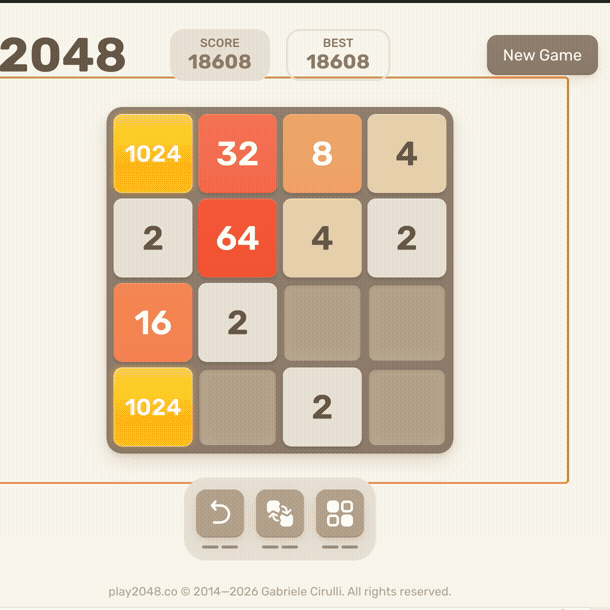
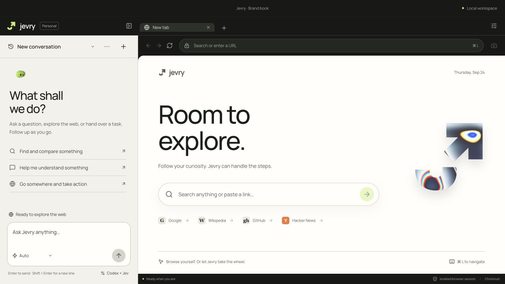

<p align="center">
  <picture>
    <source media="(prefers-color-scheme: dark)" srcset="public/brand/lockup-porcelain.svg">
    
  </picture>
</p>

<h1 align="center">Your browser. Ready to act.</h1>

<p align="center">Give Jevry a task. Watch it browse, research, and play.<br>A desktop browser with an AI agent you can stop, steer, and inspect.</p>

<p align="center">
  <a href="#get-started">Get started</a> ·
  <a href="#watch-it-win-2048">Watch the demo</a> ·
  <a href="docs/ENGINE.md">How it works</a> ·
  <a href="CONTRIBUTING.md">Contribute</a>
</p>

<p align="center">
  <a href="LICENSE"></a>
  
  
</p>

## Watch it win 2048

[](https://github.com/michaelswissa/jevry/releases/download/v0.4.0-beta.13/jevry-2048-realtime.mp4)

**“Play this game and win it.”** The recorded page reaches **2048**, displays **You Win**, and reports **20,708 points in 1,013 moves. No powerups used.** This is a continuous, real-time excerpt of the supplied September 23 recording; the GIF is a shorter preview. [Watch the MP4](https://github.com/michaelswissa/jevry/releases/download/v0.4.0-beta.13/jevry-2048-realtime.mp4) · [Editing notes and evidence boundaries](docs/launch/DEMO.md)

The demo shows an earlier interface. The source includes the new Jevry identity below. A game win demonstrates one task, not a general browser-agent success rate.

## A browser you can delegate to

Most browser work is a sequence of small decisions. Find the right page. Read it. Choose the next control. Check what changed. Jevry brings that loop into a desktop browser, alongside a persistent conversation.

| Give it a task | What Jevry brings |
| --- | --- |
| **Work through a website** | Observed page controls, native input, a visible activity feed, and follow-ups that retain context. |
| **Research across sources** | Source discovery, bounded parallel reading, and linked citations in the answer. |
| **Play a supported game** | Visual setup, local tile recognition, and Jev choosing moves from fresh state and bounded forecasts. |
| **Change direction** | Send a correction while it works, or stop with the Stop button or Escape from the page. |
| **Pick up later** | Persistent tabs, conversations, and Jevry's own website sessions. |



## Get started

**Developer preview · source version 0.4.0-beta.13.** Native runtime verification is on macOS. Windows packaging and CI are configured; Windows runtime acceptance remains outstanding. Signed installers and automatic updates are not available yet.

You need **Node.js 22.12+**, npm, a **text-model connection**, and a **[TypeSafe Jev API key](https://docs.typesafe.ai/introduction)**. Provider usage may incur charges. This is not a fully offline agent.

```sh
git clone https://github.com/michaelswissa/jevry.git
cd jevry
npm ci
npm run dev
```

1. **Connect a text model.** Use a locally signed-in Codex or Claude Code CLI, or configure an OpenAI-compatible or Anthropic API provider in the app.
2. **Connect Jev.** Enter your TypeSafe key in the app. The default is `jev-latest` at `https://api.typesafe.ai/v1/systemone`.
3. **Open a page and give it a task.** Start with something reversible, such as finding information on a public site. Use Research for a cited answer across sources.

Connections are checked during setup. Never put real keys in source files or issues. [Provider setup](docs/PROVIDERS.md) · [Security and data flow](SECURITY.md)

<details>
<summary><strong>Development commands</strong></summary>

```sh
npm run dev:web             # interface preview; native browsing requires Electron
npm test                    # unit and fixture tests; see skipped browser checks
npm run build               # TypeScript, renderer, and desktop bundles
npm run test:desktop        # real Electron with disposable profiles and model stubs
npm run test:research       # native research workflows
npx playwright install chromium
npm run test:engine-browser # guarded actions in real Chromium
npm run package:mac         # unsigned macOS package
npm run package:win         # Windows NSIS package; run on Windows
```

Native acceptance tests use isolated profiles. Live-provider scripts are separate, explicitly opt-in, and can consume paid usage. See [contributing](CONTRIBUTING.md).

</details>

## How it works

```text
Your task → text-model planning → observed browser state
                                      ↓
                               Jev picks an action
                                      ↓
                          guarded native input → fresh evidence
                                      ↑___________________|
```

The text model handles conversation, planning, and synthesis. Jev selects the next operation and target from an indexed observation. The controller checks the target and executes through Chromium, then observes again.

For supported numeric games, visual calibration and local OCR turn the board into compact state. Bounded numeric forecasts inform Jev's choice. This keeps general-purpose visual reasoning out of the normal move loop while retaining real native-input receipts. [Engine](docs/ENGINE.md) · [Games](docs/GAMES.md) · [Research](docs/RESEARCH.md)

## Evidence over promises

A **separate, instrumented beta.4 acceptance run** reached a 2048 tile with **652 ms median between keys during its continuation**, **343 ms median Jev decision time**, and **11 minutes 47 seconds across two turns**, including setup and the final answer. These numbers belong to that earlier run, not the video above or the current source. [Full results, failed attempts, and caveats](docs/GAME_RESULTS.md)

Jevry is experimental. There is **no claimed leaderboard rank, universal win rate, or “world's fastest” result**. Historical reports identify their builds and methodology. Private local run artifacts are excluded from the public source snapshot; the launch demo is independently viewable.

Today’s boundaries:

- Some cross-origin frames, closed shadow roots, uploads, drag-and-drop, download management, extensions, and password-manager workflows remain unsupported or unverified.
- Sensitive actions such as purchases and sending messages hand control back to you. These guards are not a complete defense against hostile pages.
- Model providers receive the context needed for inference. OS-encrypted local storage does not make inference offline.
- The demo and narrow fixture studies do not establish performance on a recognized browser-agent benchmark. [Benchmark status](docs/BENCHMARKS.md) · [Historical production review](docs/PRODUCTION_READINESS.md)

## Build with us

Try one real task. Tell us what happened. A reproducible failure is especially useful: the expected result, actual result, version, and a redacted screenshot help us improve the next release.

[Report a bug](https://github.com/michaelswissa/jevry/issues/new?template=bug_report.yml) · [Suggest a feature](https://github.com/michaelswissa/jevry/issues/new?template=feature_request.yml) · [Read the contribution guide](CONTRIBUTING.md)

If Jevry is useful to you, **star the repo** to help others discover it.

## Credits and license

Jevry adapts the snapshot and action-selection design of [Jev Ultrafast](https://github.com/browser-use/jev-ultrafast). Firecrawl's public web-agent source informs bounded research orchestration; Ego Lite informs browser interaction patterns. Jevry is an independent project, not an official release of those projects.

Original Jevry code is [MIT licensed](LICENSE). Third-party source, fonts, and packages retain their respective licenses: [notices](THIRD_PARTY_NOTICES.md) · [upstream revisions and boundaries](docs/UPSTREAM.md).
