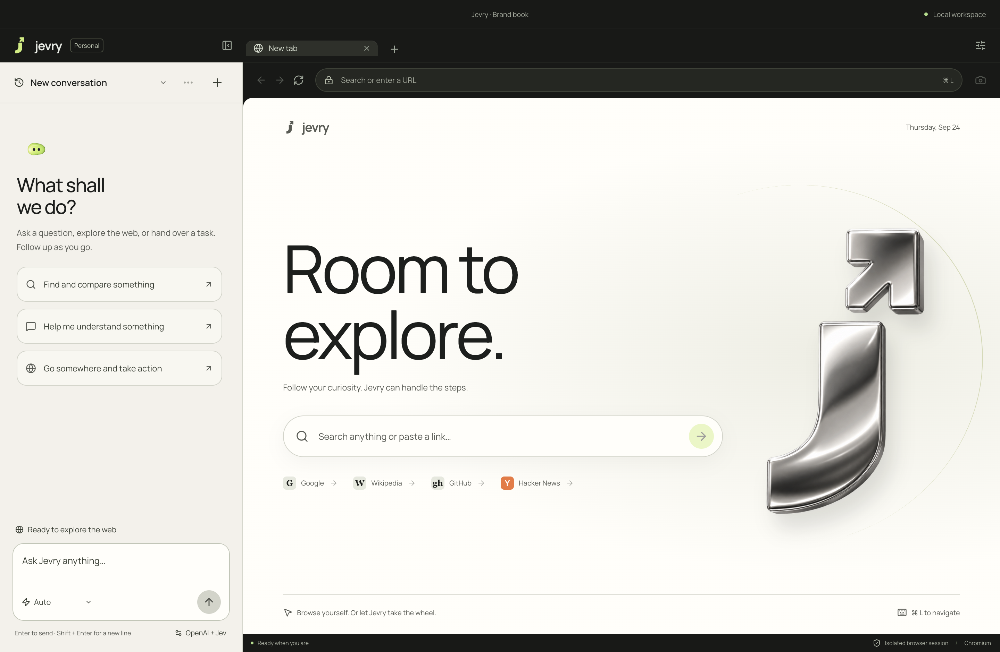
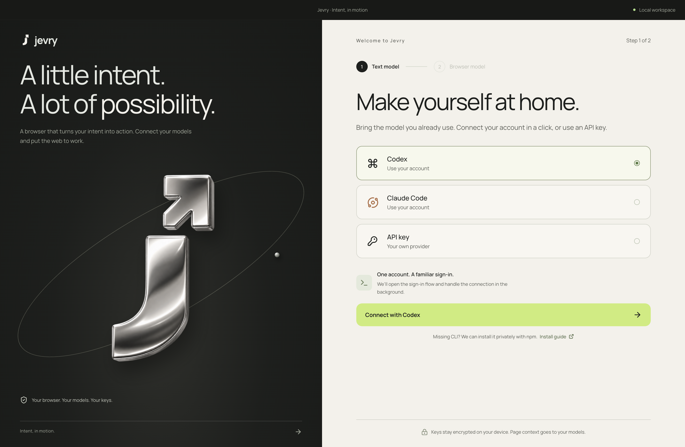
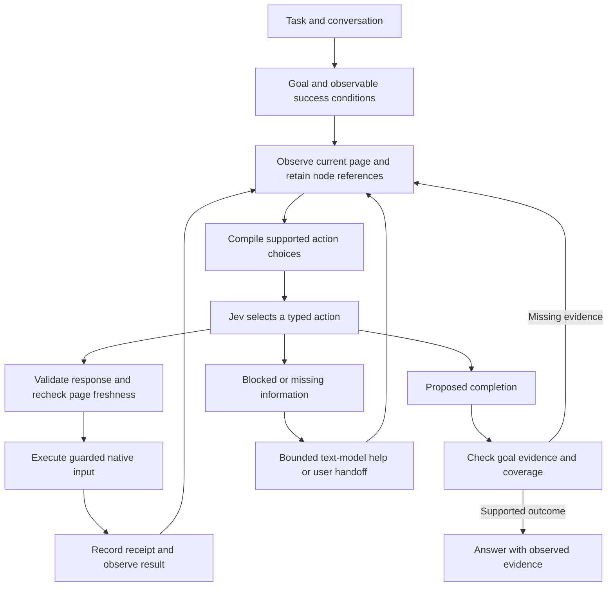

<p align="center">
  <picture>
    <source media="(prefers-color-scheme: dark)" srcset="docs/media/jevry-lockup-porcelain.svg">
    
  </picture>
</p>

<h1 align="center">A browser built around Jev.</h1>

<p align="center"><strong>Language models plan. Jev decides. Chromium acts.</strong><br>An open-source desktop browser that turns natural-language tasks into<br>structured decisions, guarded actions, and observable results.</p>

<p align="center">
  <a href="#install">Install</a> ·
  <a href="#see-it-in-action">Demo</a> ·
  <a href="#why-jev">Why Jev?</a> ·
  <a href="#how-it-works">Architecture</a> ·
  <a href="#benchmarks-and-results">Benchmarks</a> ·
  <a href="#pull-requests-are-welcome">Contribute</a>
</p>

<p align="center">
  <a href="https://github.com/michaelswissa/jevry/actions/workflows/desktop.yml"></a>
  <a href="LICENSE"></a>
  <a href="CONTRIBUTING.md"></a>
</p>

**Jevry explores a practical question: what happens when a browser's next action is a typed model decision?** The browser observes its current state, offers the actions it can actually execute, and asks TypeSafe's Jev to choose. A separate text model handles planning, language, and occasional visual reasoning. The desktop runtime owns execution, cancellation, and evidence.

Browse normally, hand over a task, watch each action, and redirect when needed. Your tabs and conversations stay in one workspace.

## See it in action



*Latest desktop design, captured from the local September 24 build.*

<details>
<summary><strong>Watch Jevry win 2048 — recorded with the earlier interface</strong></summary>

[](https://github.com/michaelswissa/jevry/releases/download/v0.4.0-beta.13/jevry-2048-realtime.mp4)

**“Play this game and win it.”** The page reaches a **2048 tile**, displays **You Win**, and reports **20,708 points in 1,013 moves, with no powerups used**.

[Watch the 30-second real-time clip](https://github.com/michaelswissa/jevry/releases/download/v0.4.0-beta.13/jevry-2048-realtime.mp4) · [Recording and edit details](docs/launch/DEMO.md)

The clip is an uninterrupted 1× excerpt from a September 23 run and shows the earlier interface. The GIF is a shorter crop focused on the game. The footage is preserved as recorded evidence and is separate from the instrumented latency study below.

</details>

## Why Jev?

[Jev](https://docs.typesafe.ai/introduction) is TypeSafe's **System One model**: it evaluates supplied context and returns typed judgments and probabilities. Its interface exposes **Choice** for selecting an option, **Score** for rubric-based ratings, and **Noul** for yes/no judgments. Jevry's action loop is built around **Choice**.

That maps naturally to a browser. The page already contains a finite set of observed controls. Jevry turns those controls into choices such as `CLICK:17`, `TYPE_TEXT:4`, `SCROLL_DOWN`, `DONE`, and `BLOCKED`, then resolves the selected choice to an application-owned operation.

| Component | Responsibility in Jevry |
| --- | --- |
| **Jev** | Choose the next supported action; select observed targets and supplied field values; assess offered completion evidence. |
| **Text / vision model** | Interpret conversation, plan richer tasks, generate missing text, synthesize research, and perform visual setup or bounded recovery. |
| **Deterministic code** | Construct the action space, validate responses, check page freshness, dispatch input, retain receipts, and enforce stop conditions. |

**Jev chooses from the browser's actual capabilities.** Its output never becomes arbitrary JavaScript, a generated selector, or a shell command. A valid choice can still be the wrong choice; structured output is an interface guarantee, not proof of task success.

Jev itself currently consumes text/structured state. Screenshots used for game calibration go through the connected vision-capable provider; local perception converts supported boards into state Jev can use. [TypeSafe's model explanation](https://docs.typesafe.ai/concepts/system-one)

## Install

**Source preview · 0.4.0-beta.13 · macOS and Windows CI.** Both platforms have passed native fixture workflows and packaged-app checks in [the public launch CI run](https://github.com/michaelswissa/jevry/actions/runs/35989440243). Real-provider experience is primarily tested on macOS. Signed installers, notarization, and automatic updates remain future work.

### 1. Get the source and start the app

Install Git and **Node.js 22.12 or newer** with npm. Then run the same commands in macOS Terminal or Windows PowerShell:

```sh
git clone https://github.com/michaelswissa/jevry.git
cd jevry
npm ci
npm run dev
```

This opens the **Electron desktop app**. Keep the terminal running during development. `npm run dev:web` previews only the interface; browser control requires the desktop app.

### 2. Connect your models



*Connection setup in the latest desktop design.*

You need **both** connections; provider usage may incur charges.

| Connection | Setup |
| --- | --- |
| **Jev — required for browser decisions** | Get a TypeSafe API key through the [official quickstart](https://docs.typesafe.ai/introduction/quickstart), then enter it in Jevry's setup. Default model: `jev-latest`. Default endpoint: `https://api.typesafe.ai/v1/systemone`. |
| **Text model — required for conversation and planning** | Connect a locally authenticated **Codex** or **Claude Code** CLI, or enter an **OpenAI-compatible / Anthropic API** connection. Jevry can privately install a missing supported CLI through its Connect flow; npm is required. |
| **Vision — for supported visual tasks** | Choose a text-provider/model combination that supports images when trying games or other visual flows. |

Keys go into the app, not source files. Setup validates the connections. [Detailed provider behavior](docs/PROVIDERS.md) · [Security and data flow](SECURITY.md)

### 3. Give it a first task

Open a public page you know, then try **“Find the installation instructions on this site.”** Keep the page visible and follow the action feed. Use **Research** to compare sources, send a follow-up to change direction, or press **Stop** / Escape from page focus.

<details>
<summary><strong>Build a local app, update, or troubleshoot setup</strong></summary>

For a local build:

```sh
npm run build
npm start
```

For distributable packages, run the appropriate command on its target OS:

```sh
npm run package:mac    # macOS DMG / ZIP
npm run package:win    # Windows NSIS installer
```

These are unsigned developer packages. The public release currently provides source and demo assets.

To update an unmodified clone, run `git pull --ff-only`, then `npm ci` and restart `npm run dev`. Preserve your changes before updating a modified checkout.

| Symptom | First thing to check |
| --- | --- |
| Install/build fails | `node --version` must be at least 22.12; use `npm ci` with the checked-in lockfile. |
| Interface opens but cannot browse | Launch `npm run dev` or the built Electron app, rather than the web-only preview. |
| Jev connection fails | Use a TypeSafe key and the System One endpoint; it is a different API from Chat Completions. |
| Local CLI cannot connect | Complete its authentication flow, or configure an API provider. See the provider guide for supported discovery paths. |
| Visual task fails | Confirm your selected provider/model supports image input. |

Still stuck? [Open an issue](https://github.com/michaelswissa/jevry/issues/new?template=bug_report.yml) with OS, version, steps, and a redacted error.

</details>

## What can you do with it?

Example prompts are starting points, not promises that every website is supported. The evidence column distinguishes measured scenarios from uses to explore.

| Use case | Example task | Evidence / scope |
| --- | --- | --- |
| **Forms with follow-up context** | “Search for Paris for two guests.” → “Now London, same guests.” | Exercised with live providers on controlled travel fixtures. |
| **Page-grounded questions** | “What result is currently shown?” | Read-only follow-ups tested without extra browser actions. |
| **Research and comparison** | “Compare the cancellation policies on these two pages and cite them.” | Live fixed-corpus study; native source discovery and citation checks. |
| **Catalogs and admin tables** | “Find the records matching these filters.” | Included in the WebArena-Verified development subset; multi-page completeness remains a known failure mode. |
| **Documentation navigation** | “Find this library's getting-started guide.” | Supported link/search controls; try on accessible public sites. No separate success-rate claim. |
| **Numeric puzzle games** | “Play this game and win it.” | Recorded public 2048 victory and a separate instrumented acceptance run. |
| **Small discrete games** | “Win this board game.” / “Reach the other side.” | Three-in-a-row and crossing-game fixtures reached their observed victory states. |
| **Work you can interrupt** | “Stop that search; compare these sources instead.” | Redirect cancellation, retained context, and restart persistence tested in native workflows. |

HTML/ARIA controls, native selects, contenteditable fields, open shadow roots, nested scrolling, and bounded same-origin iframe interactions are supported. [Detailed interaction coverage](docs/ENGINE.md#supported-page-interactions)

## How it works



### Observe → choose → execute → verify

1. **Observe atomically.** Capture page text and compatible controls together, retaining actual DOM-node references in an isolated browser world. The action refers to the observed node, not a selector invented afterward.
2. **Compile the decision.** Eligible ordinary pages use a Choice over complete operation/target pairs. Other supported states use an operation question plus speculative target questions in the same request. Only the selected branch is consumed.
3. **Let Jev choose.** Routine action selection uses one inference round trip. Explicit user literals can be offered as field-value choices; missing text can require the text helper. Completion and recovery can add calls.
4. **Validate before input.** Check the offered choice set and probability distribution, then recheck the document, target, current value, visibility, and occlusion. A stale decision is discarded.
5. **Record what actually happened.** Input receipts survive navigation failures. Once a mutation may have started, uncertainty stops the run instead of replaying the action.
6. **Check the whole objective.** Completion checks consider goal evidence and coverage. Seeing a matching row does not establish that all requested pages were read. Model-assessed completion remains distinct from independently verified success.

The fan-out design uses TypeSafe's ability to evaluate independent questions together. A target question cannot read another question's answer, so Jevry either makes the complete action explicit or gives each speculative branch its own assumptions. [Official fan-out pattern](https://docs.typesafe.ai/patterns/fan-out)

### Why the 2048 loop can stay small

A vision-capable model helps calibrate the board. Local pixel matching and OCR then read numbered tiles. For validated 4×4 equal-value merge boards, bounded lookahead computes legal transitions and ranks candidate positions. **Jev selects every dispatched move from that state and those forecasts.**

The executor keeps canvas focus for the run, sends native keys, and reads the resulting board. The normal numeric move loop avoids repeated general-purpose visual reasoning. Unfamiliar appearances or incompatible layouts can still require it. This is an explicit rule-family adapter, not evidence that Jev inferred game physics from pixels. [Game architecture and limits](docs/GAMES.md)

**Go deeper:** [Jev decision architecture](docs/JEV_ARCHITECTURE.md) · [Engine internals](docs/ENGINE.md) · [Research pipeline](docs/RESEARCH.md) · [Conversation lifecycle](docs/CONVERSATIONS.md)

## Benchmarks and results

Measurements belong to their named builds and protocols. The following are three different types of evidence; they should not be combined into one score.

### WebArena-Verified: 10/12 on a development subset

The `speed-006` candidate, using the packaged beta.5 app, passed **10 of 12 selected tasks (83.3%)** under the **unchanged official WebArena-Verified evaluator**. The actor used live providers through Jevry's normal task interface. No task-solving script or reference answers were supplied to the acting model.

| Same 12-task development subset | `speed-005` | `speed-006` |
| --- | ---: | ---: |
| Official passes | 7/12 | **10/12** |
| Total actor time | 456.707 s | 542.831 s |
| Median task time | 23.367 s | 44.169 s |
| Median Jev request time | 443 ms | **392 ms** |

**Accuracy improved while overall execution became slower.** Faster individual decisions did not eliminate repeated navigation and broad completion checks. Tasks 47 and 102 still failed in `speed-006`.

This is a repeatedly used **development subset of an 812-task benchmark**, not a held-out/full-suite result or accepted leaderboard submission. Local environment compatibility changes and incomplete dataset provisioning are documented. These runs do not measure the newer beta.13 source.

[All-attempt score table and public JSON](docs/benchmarks/README.md) · [All development attempts, failures, and methodology](docs/BENCHMARKS.md)

### 2048: measured decisions and a verified game objective

The **separate beta.4 acceptance run** reached the 2048 tile and the game's victory screen, with 20,840 points and 986 game-counted moves.

| Measurement | Recorded result |
| --- | ---: |
| Median Jev decision, continuation turn | **343 ms** |
| Median interval between native keys, continuation turn | **652 ms** |
| 95th percentile key interval, continuation turn | 770 ms |
| General-purpose visual reviews during continuation | **0** |
| Total across initial + continuation turns, including setup and final answer | 11 min 47 s |

One successful instrumented run; initial setup still took tens of seconds. The supplied launch video is another recording with different totals. [Full game results, interrupted attempts, and build identities](docs/GAME_RESULTS.md)

<details>
<summary><strong>Shared-task comparison: Jevry and an adapted Firecrawl source graph</strong></summary>

The historical beta.1 study ran three five-turn sessions per implementation, with the same fixture tasks and resolved Claude model. Jevry also used Jev for browser decisions.

| Task | Jevry median | Firecrawl source adapter median |
| --- | ---: | ---: |
| Paris / two guests | 10.772 s | 14.690 s |
| London / retain guests | 7.715 s | 9.504 s |
| Read-only follow-up | 5.482 s | 6.002 s |
| Discover and compare policies | 17.139 s | 16.765 s |
| Cancellation follow-up | 4.916 s | 6.107 s |
| Complete five-turn session total | **48.341 s** | **52.782 s** |

The session-total median was 8.4% lower for Jevry; policy research was slower. The last row is the median of session totals, not the sum of task medians. Both met 15/15 requested criteria after non-blinded assistant semantic review; each retained an automatic checker false negative.

This compares actual Firecrawl source orchestration with an injected local-browser toolkit and Claude bridge, **not its hosted product**. Browser versions/viewports differed, two native probes overlapped Firecrawl sessions, and three repetitions cannot establish statistical significance. Browser launch and initial fixture navigation were excluded. [Ranges, raw-score caveats, and historical v0.3 results](docs/COMPETITIVE_REVIEW.md)

A separate deterministic execution-coverage test passed 15/15 for Jevry versus 6/15 for the pinned upstream Jev implementation. It measures those fixtures with mocked decisions, not model intelligence.

</details>

### Reproducible engineering checks

The [public launch CI run](https://github.com/michaelswissa/jevry/actions/runs/35989440243) passed on **macOS and Windows**, including builds, native desktop/research/verification fixtures, Chromium action tests, and packaged-app checks. Local launch validation recorded 571 default test passes with 100 opt-in skips, plus 120 selected Chromium checks; these counts overlap.

```sh
npm test
npm run build
npm run test:desktop
npm run test:research
npm run test:challenges
npx playwright install chromium
npm run test:engine-browser
```

These workflows use disposable profiles and deterministic providers. They verify mechanics; live model quality is measured separately. [Evaluation protocol](docs/BENCHMARKS.md) · [Performance methodology](docs/PERFORMANCE.md)

## Engineering worth inspecting

| Design decision | Why it matters | Start reading |
| --- | --- | --- |
| Complete action choices with fan-out fallback | Keeps operation/target relationships explicit while bounding choice cardinality. | [Action compiler](desktop/jev-web-actions.ts) |
| Isolated, document-bound observations | Stops stale references from silently targeting a changed page. | [Snapshot](desktop/snapshot.ts), [native evaluator](desktop/native-evaluator.ts) |
| Coverage-aware completion | Distinguishes one visible match from a complete answer across requested records. | [Task completion](desktop/task-completion.ts), [observation memory](desktop/observation-memory.ts) |
| Receipt-preserving cancellation | Keeps the record of dispatched input and avoids replay after uncertain mutations. | [Engine](desktop/engine.ts), [turn lifecycle](desktop/turn-work.ts) |
| Local numeric perception | Keeps repetitive board reading out of the general vision loop. | [Game perception](desktop/game-perception.ts), [OCR](desktop/numeric-ocr.ts), [forecasting](desktop/slide-merge.ts) |
| Separate actor and evaluator | Lets official outcome checks disagree with the agent's own completion claim. | [Benchmark input boundary](scripts/benchmarks/agent-input.mjs), [runner](scripts/benchmarks/run-webarena.mjs) |

## Pull requests are welcome

**PRs, bug reports, benchmark reproductions, and documentation improvements are welcome.** You do not need to start with a large feature. A small reproducible failure and a focused fix are valuable contributions.

Particularly useful work:

- **Browser reliability:** pagination, dynamic controls, accessible names, and bounded frame support.
- **Decision quality:** smaller state representations, action schemas, and uncertainty handling measured against actual outcomes.
- **Evaluation:** reproducible benchmark environments, retained failure traces, and frozen held-out runs.
- **Desktop distribution:** fresh-install testing, signing, notarization, and updates.
- **Developer experience:** setup guides, useful examples, and clearer errors.

Open an issue before a large change. Include what changed, why, and the checks you ran in your PR. Browser tests must use disposable profiles; game changes should preserve the documented beta.4 baseline. [Contribution guide](CONTRIBUTING.md) · [Report a bug](https://github.com/michaelswissa/jevry/issues/new?template=bug_report.yml) · [Start a discussion](https://github.com/michaelswissa/jevry/discussions)

If this architecture interests you, **star the repository**, try a task, and share a reproducible result.

## Boundaries and roadmap

Jevry is an experimental developer preview. Uploads, drag-and-drop, download management, extensions, password-manager workflows, and some cross-origin or closed-shadow interactions remain unsupported or unverified. Sensitive actions such as purchases and sending messages hand control to the user; label-based guards are not a complete defense against hostile pages.

Connections and conversation archives use OS-backed local encryption, while connected providers receive relevant prompts/page context and, for supported visual tasks, images. Jevry uses its own persistent browser profile. **Local storage does not imply offline inference.** [Security policy](SECURITY.md)

Next priorities are broader frozen evaluation, more reliable completion and pagination, fresh-provider/platform acceptance, and signed distribution. Historical reports retain their original dates and build boundaries. Private raw logs remain local; the published benchmark JSON intentionally contains scores and metadata without task answers, cookies, or provider secrets.

## Credits and license

Created by [Michael Swissa](https://github.com/michaelswissa). Jevry is an independent project built around **TypeSafe's Jev model**; Michael did not train or create Jev.

Jevry adapts [Jev Ultrafast](https://github.com/browser-use/jev-ultrafast)'s MIT-licensed snapshot and action-loop design into a persistent Electron browser, extending it with conversations, research, guarded visual/game control, completion evidence, and evaluation infrastructure. Firecrawl's public source and Ego Lite's interaction patterns also informed the architecture. [Upstream revisions and integration boundaries](docs/UPSTREAM.md)

Original Jevry code is [MIT licensed](LICENSE). Third-party code, fonts, and packages retain their own licenses in [THIRD_PARTY_NOTICES.md](THIRD_PARTY_NOTICES.md). This project is not an official product or endorsement of TypeSafe, Browser Use, Anthropic, or OpenAI.
